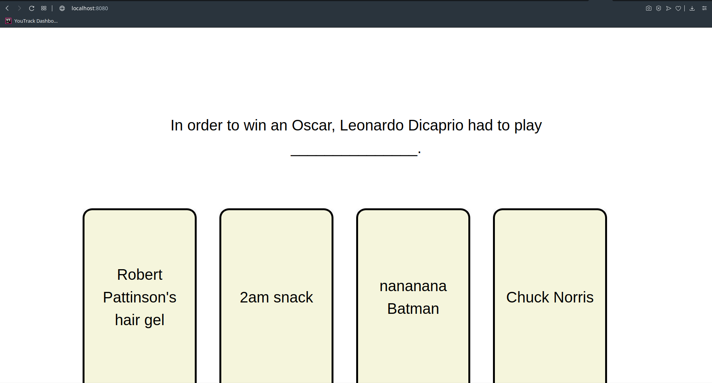
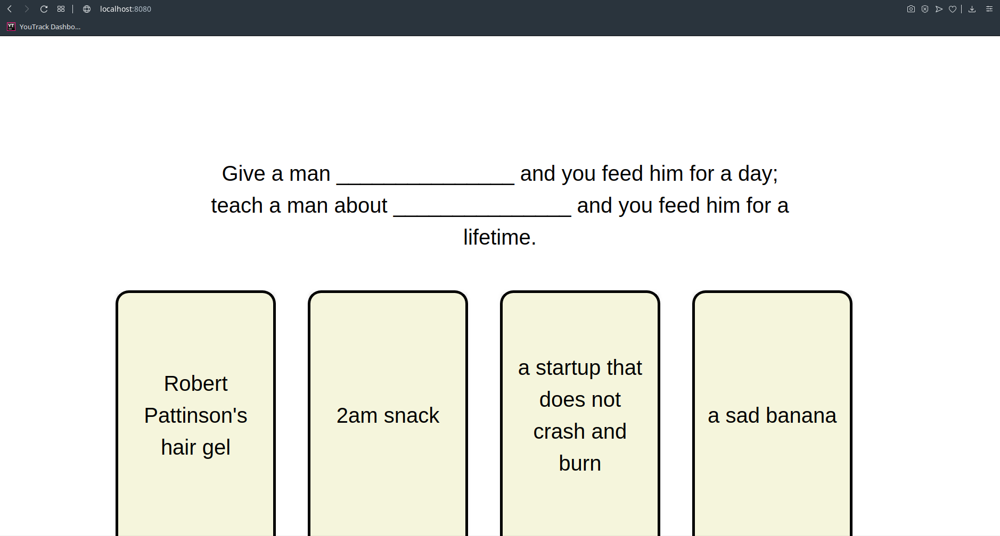
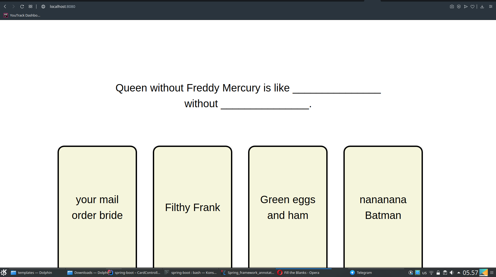
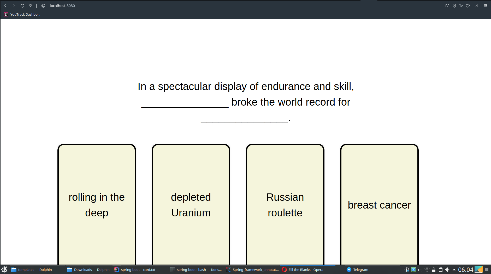
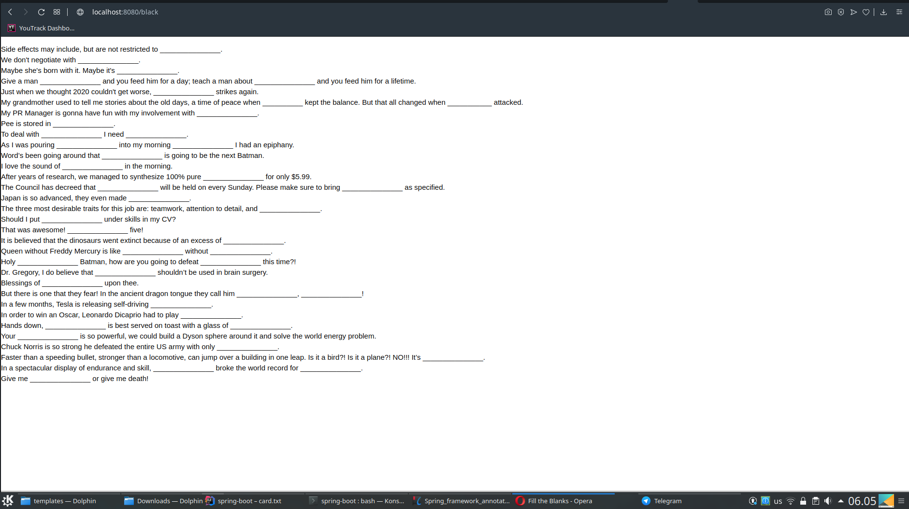
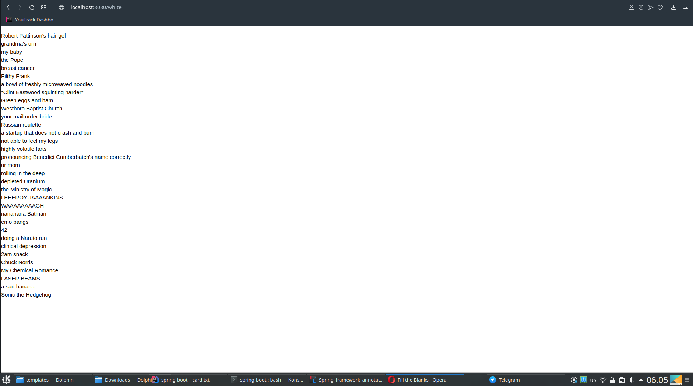

# Here are some screenshots of the main app feature:

# On /black and /white, through a GET request, you can see black and white cards (as traditionally called because of Cards Against Humanity):

